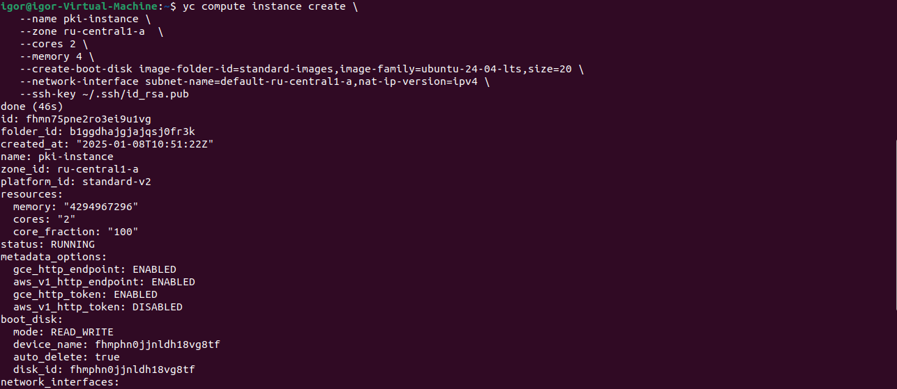
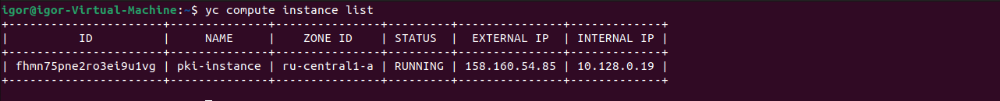
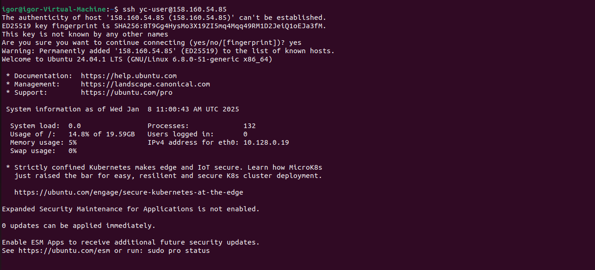
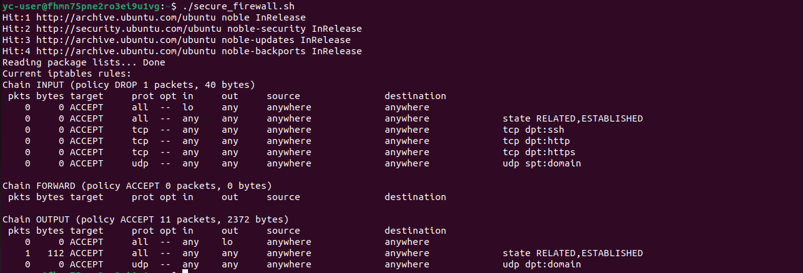

## Результаты создания виртуальной машины

1. выполнение команды создания виртуальной машины 
2. получение ip, созданной виртуальной машины 
3. подключение к виртуальной машине 
4. запрет всех входящих соединений, кроме соединений по tcp портам 22,80,443 